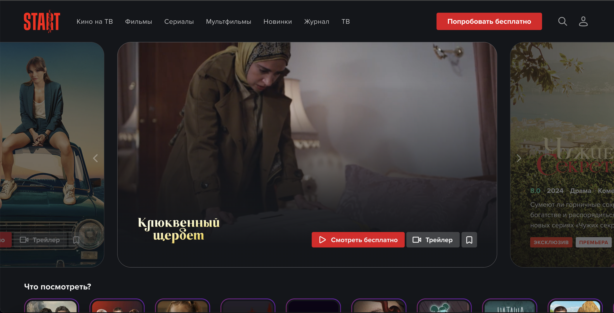

# Проект по тестированию онлайн кинотеатра Старт

START — российский онлайн-кинотеатр, запущенный в октябре 2017 года компанией «Yellow, Black and White».  
Сайт [start.ru](https://start.ru/)



<!-- Список проверок-->
## Список проверок, реализованных в автотестах:

### UI автотесты:

* ✅ Проверка успешной авторизации по email
* ✅ Проверка показа виртуальному пользователю popup о регистрации при добавлении контента в избранное
* ✅ Проверка добавления контента в Избранное авторизованным пользователем  
* ✅ Проверка перехода по логотипу Start на главную страницу
* ✅ Проверка названий разделов в хэдере для детского профиля
* ✅ Проверка успешной регистрации по email
* ✅ Проверка показа 1 результата запроса поиска в dropdown хэдера
* ✅ Проверка отображения множественных результатов запроса на странице поиска
* ✅ Проверка отображения текста заглушки при отсутсвующем результате запроса на странице поиска

### API автотесты:  

* ✅ Проверка ответа и его схемы на запрос карточки фильма
* ✅ Проверка ответа и его схемы на запрос карточки сериала
* ✅ Проверка ответа и его схемы на запрос Избранного авторизованного пользователя
* ✅ Проверка ответа на запрос раздела "Новинки"
* ✅ Проверка ответа и его схемы на запрос поиска контента с 1 результатом в ответе

<!-- Tools -->

## Проект реализован с использованием:

<p  align="left">
<code></code>
<code></code>
<code></code>
<code></code>
<code></code>
<code></code>
<code></code>
<code></code>
<code></code>  
<code></code>   
<code></code>
<code></code>
<code></code>
<code></code>

>
Для написания UI-тестов используется фреймворк `Selene`, современная «обёртка» вокруг `Selenium WebDriver`
Библиотека модульного тестирования: `PyTest`  
`Jenkins` выполняет удаленный запуск тестов в графическом интерфейсе. Установки дополнительных приложений на компьютер
пользователя не требуется.  
`Selenoid` запускает браузер с тестами в контейнерах `Docker` (и записывает видео)  
Фреймворк `Allure Report` собирает графический отчет о прохождении тестов  
После завершения тестов `Telegram Bot` отправляет в `Telegram` краткий вариант `Allure Report`

## Локальный запуск UI и API тестов  

1) Необходимо создать следующий файл:
   * `.env`  для запуска UI тестов локально и заполнить его актуальными тестовыми параметрами.
   * Пример заполнения файла указан в файле с расширением `.env.example`
2) Скачать проект и открыть в IDE
3) Для локального запуска необходимо выполнить команду в терминале:
    * Все тесты:
    Параметры:
      * --context=web_local
      * --browser_name= на выбор доступны `chrome` и `firefox`
      * --browser_version= оставить пустым, чтобы был скачан актуальный вебдрайвер
      
    ```commandline
    pytest . --context=web_local --browser_name=BROWSER_NAME --browser_version=
    ```
   * API тесты:
   Параметры --context= --browser_name= --browser_version= оставить пустыми.
   
    ```commandline
    pytest tests/API --context= --browser_name= --browser_version=
    ```
   * UI тесты:
   Параметры:
      * --context=web_local
      * --browser_name= на выбор доступны `chrome` и `firefox`
      * --browser_version= оставить пустым, чтобы был скачан актуальный вебдрайвер
     
    ```commandline
    pytest . --context=web_local --browser_name=BROWSER_NAME --browser_version=
    ```
      
4) Выполнить запрос на формирование отчета  
   note: команда для Windows

```commandline
allure serve
```
   note: команда для MacOS и Linux

```commandline
allure serve allure-results
```

Результат: откроется страница с отчетом Allure Report
