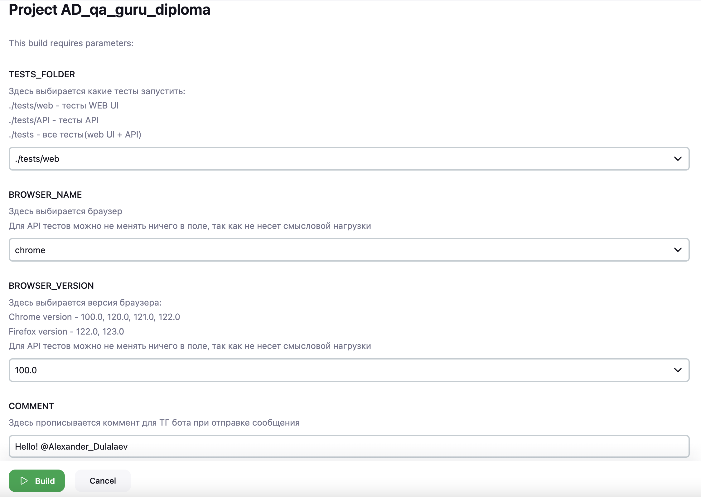
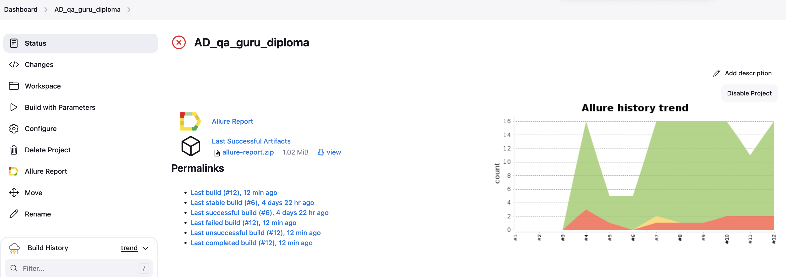
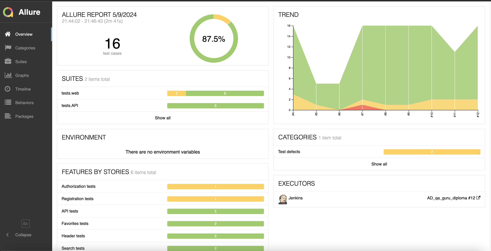
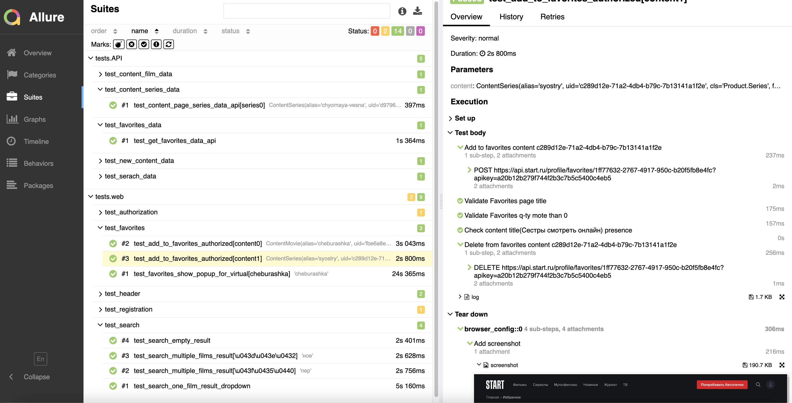
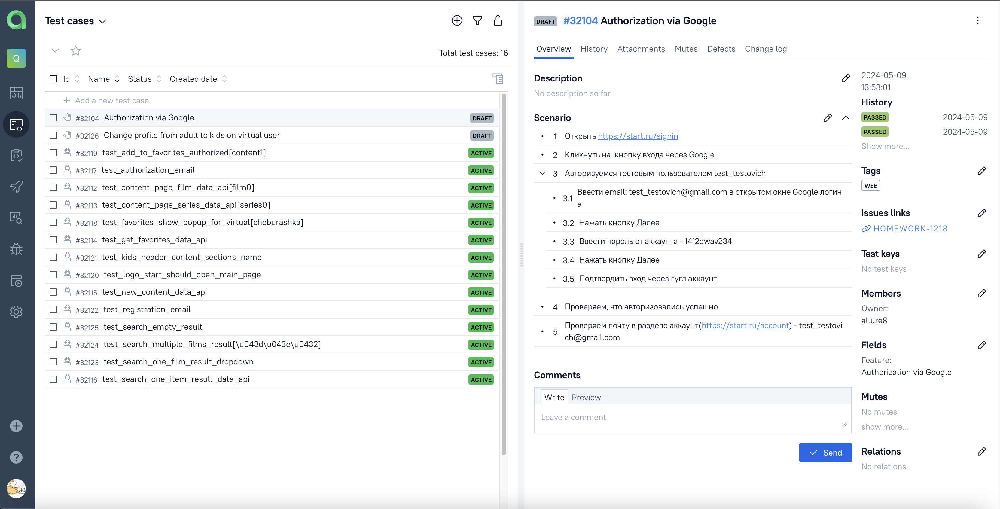
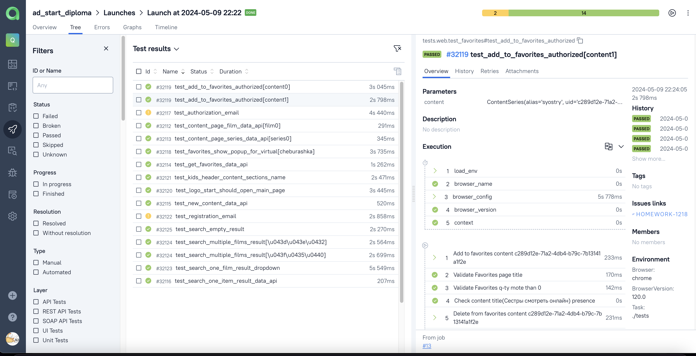
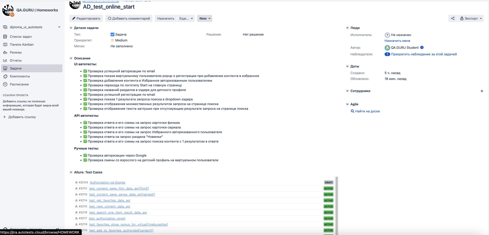
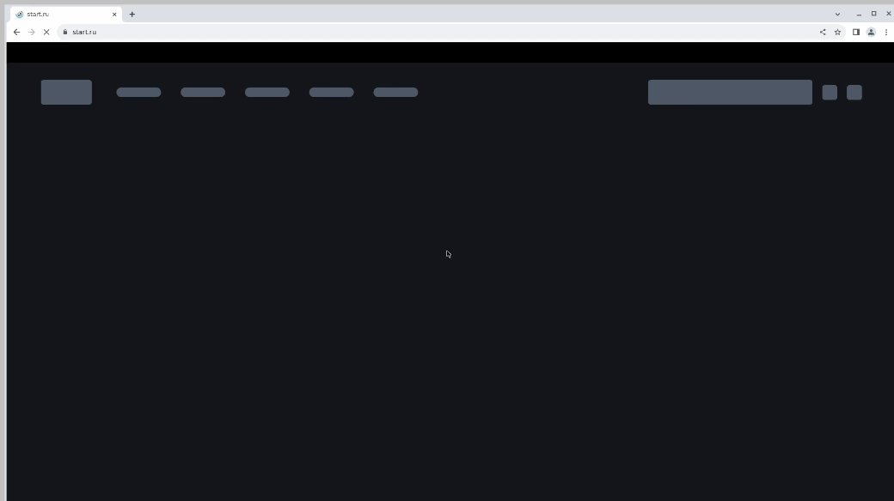
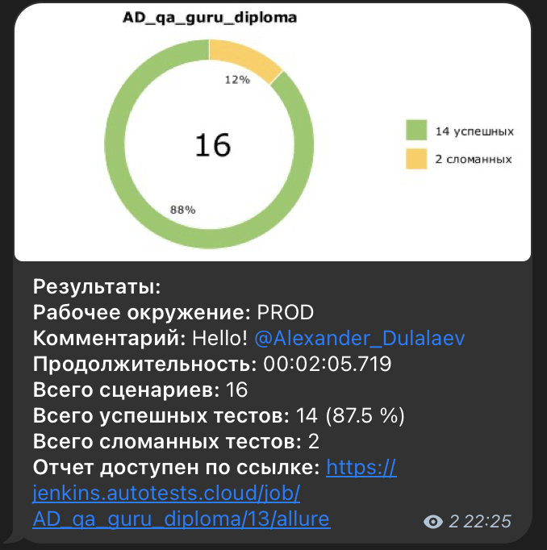

# Проект по тестированию онлайн кинотеатра Старт

**START** — российский онлайн-кинотеатр, запущенный в октябре 2017 года компанией «Yellow, Black and White».  
**Сайт** [start.ru](https://start.ru/)


<!-- Список проверок-->
## Список проверок, реализованных в автотестах:

### UI автотесты:

* ✅ Проверка успешной авторизации по email
* ✅ Проверка показа виртуальному пользователю popup о регистрации при добавлении контента в избранное
* ✅ Проверка добавления контента в Избранное авторизованным пользователем  
* ✅ Проверка перехода по логотипу Start на главную страницу
* ✅ Проверка названий разделов в хэдере для детского профиля
* ✅ Проверка успешной регистрации по email
* ✅ Проверка показа 1 результата запроса поиска в dropdown хэдера
* ✅ Проверка отображения множественных результатов запроса на странице поиска
* ✅ Проверка отображения текста заглушки при отсутсвующем результате запроса на странице поиска

### API автотесты:  

* ✅ Проверка ответа и его схемы на запрос карточки фильма
* ✅ Проверка ответа и его схемы на запрос карточки сериала
* ✅ Проверка ответа и его схемы на запрос Избранного авторизованного пользователя
* ✅ Проверка ответа на запрос раздела "Новинки"
* ✅ Проверка ответа и его схемы на запрос поиска контента с 1 результатом в ответе

<!-- Tools -->

## Проект реализован с использованием:

<p  align="center">
<code></code>
<code></code>
<code></code>
<code></code>
<code></code>
<code></code>
<code></code>
<code></code>
<code></code>  
<code></code>   
<code></code>
<code></code>
<code></code>
<code></code>

>
Для написания UI-тестов используется фреймворк `Selene`, современная «обёртка» вокруг `Selenium WebDriver`
Библиотека модульного тестирования: `PyTest`  
`Jenkins` выполняет удаленный запуск тестов в графическом интерфейсе. Установки дополнительных приложений на компьютер
пользователя не требуется.  
`Selenoid` запускает браузер с тестами в контейнерах `Docker` (и записывает видео)  
Фреймворк `Allure Report` собирает графический отчет о прохождении тестов  
После завершения тестов `Telegram Bot` отправляет в `Telegram` краткий вариант `Allure Report`

## Локальный запуск UI и API тестов  

1. Скачать проект и открыть в IDE 
2. Создайте следующий файл:
   * `.env`  для запуска UI тестов локально и заполнить его актуальными тестовыми параметрами.
   * Пример заполнения файла указан в файле с расширением `.env.example`
3. Создайте и активируйте виртуальное окружение
   ```bash
   python -m venv .venv
   source .venv/bin/activate
   ```
4. Установите зависимости с помощью pip
   ```bash
   pip install -r requirements.txt
   ```
5. Для локального запуска необходимо выполнить команду в терминале:
    * Все тесты:<br>
    ```bash
    pytest ./tests --context=web_local --browser_name=BROWSER_NAME --browser_version=
    ```
    * UI тесты:<br>
    ```bash
    pytest tests/web --context=web_local --browser_name=BROWSER_NAME --browser_version=
    ```
   
   * API тесты:<br>
    ```bash
    pytest tests/API --context= --browser_name= --browser_version=
    ```
   Параметры:
      * --context=web_local для локального запуска. Для запуска через Selenoid будет web_selenoid
      * --browser_name= на выбор доступны `chrome` и `firefox`
      * --browser_version= оставить пустым, чтобы был скачан актуальный вебдрайвер
      
6. Выполнить запрос на формирование отчета:
* команда для Windows
```bash
allure serve
```
* команда для MacOS
```bash
allure serve allure-results
```

<!-- Jenkins -->
##  Удаленный запуск автотестов выполняется на сервере Jenkins

<a target="_blank" href="https://jenkins.autotests.cloud/job/AD_qa_guru_diploma/">Ссылка на проект в Jenkins</a>

### Параметры сборки
Данные параметры не обязательны для заполнения.

* `TESTS_FOLDER` - параметр определяет какие тесты будут запущены, по умолчанию ./tests/web - тесты WEB UI
* `COMMENT` - комментарий, который будет отправлен в сообщении от бота в Телеграм
* `BROWSER_NAME` - выбор браузера для запуска тестов, по умолчанию chrome
* `BROWSER_VERSION` - выбор версии браузера для запуска тестов, по умолчанию 100.0



### Запуск автотестов в Jenkins

1. Открыть <a target="_blank" href="https://jenkins.autotests.cloud/job/AD_qa_guru_diploma/">проект</a>



2. Выбрать пункт **Build with Parameters**

3. Внести изменения в конфигурации сборки, при необходимости

4. Нажать **Build**

5. Результат запуска сборки можно посмотреть в классическом формате Allure Results

### Allure отчет


Отчет позволяет получить детальную информацию по все шагам тестов, включая скриншоты и log - файлы



## Интеграция с Allure TestOps

<a target="_blank" href="https://allure.autotests.cloud/project/4217/dashboards">Ссылка на проект в
AllureTestOps</a> (запрос доступа `admin@qa.guru`)

#### Список всех кейсов, имеющихся в проекте



#### Отображение результатов прогона тестов



## Интеграция с Jira

<a target="_blank" href="https://jira.autotests.cloud/browse/HOMEWORK-1218">Ссылка на проект в Jira</a>



## Видео прохождения теста:

Видеозапись каждого теста генерируется с помощью `Selenoid` после успешного запуска контейнера c тестами в `Docker`.



## Получение уведомлений о прохождении тестов в Telegram

После завершения сборки специальный Telegram-бот отправляет сообщение с отчетом.  


